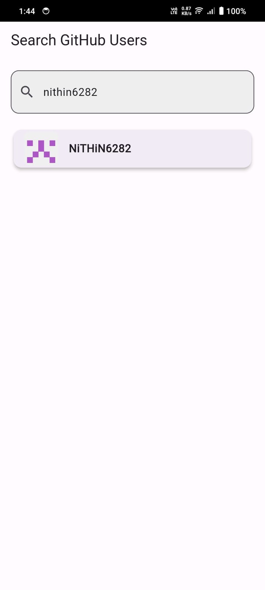
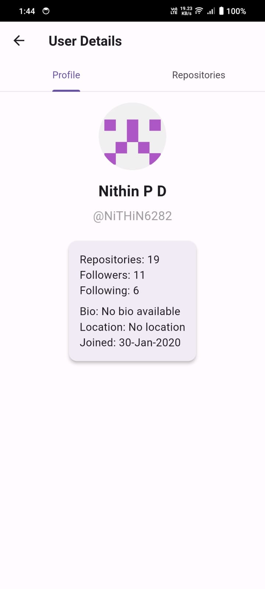
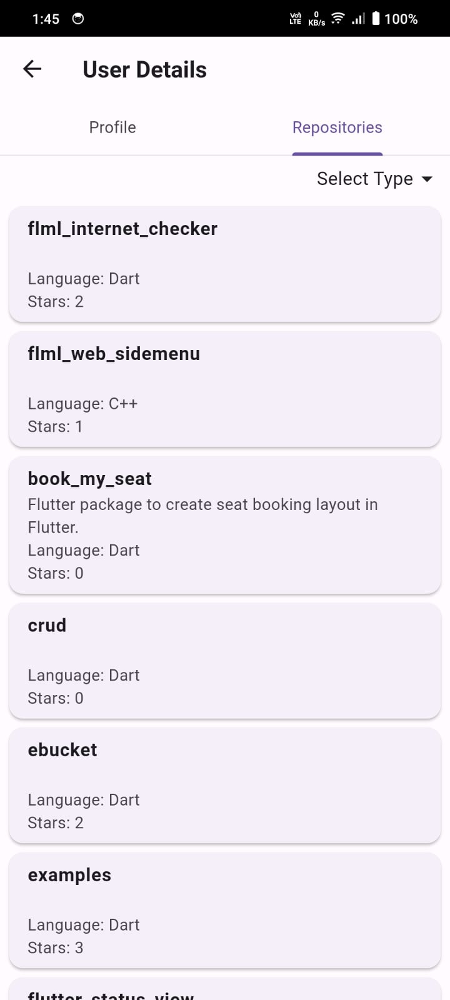

# Flutter Project
This Flutter application allows users to search GitHub usernames and view user details and repositories. It demonstrates mvc architecture with proper state management, modular structure.

## Project Structure
```
lib/
├── main.dart                 # Application entry point
├── core/                     # Core functionality
│   ├── utils.dart            # Utility functions including launchRepo
│   └── providers/            # Global providers
│       └── internet_checker_provider.dart  # Internet connectivity checker
├── features/                 # Feature modules
│   └── users/                # Users feature
│       ├── controller/       # User controllers
│       ├── repository/       # User data repositories
│       └── screens/          # User interface screens
└── models/                   # Data models
    ├── user_search_model.dart # User search model
    ├── user_model.dart        # User model
    └── repository_model.dart # Repository model
```

## Features
### Core Functionality
- **Utils**: Contains utility functions like `launchRepo` for opening repository URLs in the browser
- **Internet Connectivity**: Monitors and provides internet connection status throughout the app

### User Management
The application includes comprehensive user management features with:
- User search functionality
- User profile display
- Repository listing and open in browser
- **Pagination**: Loads more results as users scroll
- **Repository Filtering**: Sort repositories by type (All, Owner, Member)

## Screenshots

<div style="display: flex; flex-wrap: wrap; gap: 10px;">
  
  
  
</div>

## API Integration

This project uses the GitHub REST API for fetching user data:

- User Search: `https://api.github.com/search/users`
- User Details: `https://api.github.com/users/USERNAME`
- User Repositories: `https://api.github.com/users/USERNAME/repos`

The API integration includes:
- **Pagination**: Implemented for efficient data loading as users scroll
- **Repository Filtering**: API parameters for filtering repositories by type

## Getting Started
### Installation
1. Clone the repository
   ```
   git clone https://github.com/NiTHiN6282/github_api_riverpod.git
   ```
2. Navigate to the project directory
   ```
   cd github_api_riverpod
   ```
3. Install dependencies
   ```
   flutter pub get
   ```
4. Set up GitHub token (see below)
5. Run the application
   ```
   flutter run
   ```

### GitHub Token Setup
This application requires a GitHub personal access token to authenticate API requests.

1. Create a `.env` file in the root directory of the project
2. Add your GitHub token to the file:
   ```
   GITHUB_TOKEN=your_github_token_here
   ```

#### How to Generate a GitHub Token
1. Go to your GitHub account
2. Navigate to Settings > Developer settings > Personal access tokens > Tokens (classic)
3. Click "Generate new token"
4. Give your token a descriptive name
5. For public repositories and user data, no specific scopes need to be selected
6. Click "Generate token"
7. **Important**: Copy your token immediately as GitHub will only show it once
8. Paste the token into your `.env` file as shown above

**Note**: Never commit your `.env` file to version control. Make sure it's included in your `.gitignore` file.

## Architecture
This project follows a clean architecture approach with:
- **Models**: Data classes representing the core business objects
- **Repositories**: Handle data operations and abstractions over data sources
- **Controllers**: Manage business logic and state
- **Screens**: User interface components

## Key Components
### Models
- **UserModel**: Represents user data structure
- **UserSearchModel**: Contains search parameters and results for user queries
- **RepositoryModel**: Represents code repository data